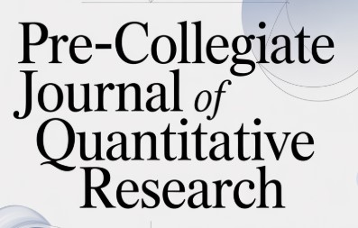

<h1>Pre-Collegiate Journal of Quantitative Research</h1>

Motto: Scientific Curiosity Fueled by Positivity

Welcome to the <strong>Pre-Collegiate Journal of Quantitative Research (PCJQR)</strong> — an academic platform dedicated to showcasing rigorous, original research conducted by exceptional high school students in statistics, mathematics, machine learning, biostatistics, probability, and quantitative modeling.

<h2>About the Journal</h2>

The Pre-Collegiate Journal of Quantitative Research publishes high-quality student work that demonstrates genuine scientific inquiry and technical depth. Each contribution is typically produced through independent or mentored research programs that emphasize:

<ul>
  <li>Mathematical and statistical rigor</li>
  <li>Reproducible methodologies</li>
  <li>Clarity of interpretation</li>
  <li>Relevance to the broader scientific community</li>
</ul>

The journal seeks to elevate young scholars by providing a professional venue for early research dissemination.

<h2>Scope</h2>

PCJQR accepts research across a wide range of quantitative disciplines, including but not limited to:

<ul>
  <li><strong>Statistics &amp; Biostatistics</strong></li>
  <li><strong>Probability &amp; Stochastic Processes</strong></li>
  <li><strong>Machine Learning &amp; Data Science</strong></li>
  <li><strong>Mathematical Modeling</strong></li>
  <li><strong>Epidemiology</strong></li>
  <li><strong>Operations Research</strong></li>
  <li><strong>Computational Methods</strong></li>
</ul>

Interdisciplinary work with strong quantitative foundations is also welcomed.

<h2>Submission Guidelines</h2>
<ul>
  <li>Manuscripts should be written in clear, formal academic English.</li>
  <li>All submissions must include:
    <ul>
      <li>Title and author information</li>
      <li>Abstract (150–300 words)</li>
      <li>Introduction and background</li>
      <li>Methods and technical framework</li>
      <li>Results with tables/figures as appropriate</li>
      <li>Discussion and conclusions</li>
      <li>References formatted consistently</li>
    </ul>
  </li>
  <li>Submissions must represent original work by high school students.</li>
  <li>Mentors may be acknowledged but cannot be listed as co-authors.</li>
</ul>

<h2>Review Process</h2>

All manuscripts undergo editorial screening followed by formal peer review. Review focuses on:

<ul>
  <li>Technical correctness</li>
  <li>Rigor and reproducibility</li>
  <li>Clarity of exposition</li>
  <li>Contribution to the field</li>
</ul>

Revisions may be requested before final acceptance.

<h2>Publication Format</h2>

Accepted papers are published online as part of the journal's regular issues. Each article receives:

<ul>
  <li>A DOI or stable URL</li>
  <li>A formal citation format</li>
  <li>Professional typesetting</li>
</ul>

<h2>Contact</h2>

For inquiries about submissions, editorial policies, or partnership opportunities, please contact the editorial team.

Thank you for your interest in the Pre-Collegiate Journal of Quantitative Research. We are proud to support the next generation of quantitative scientists.

</html>
